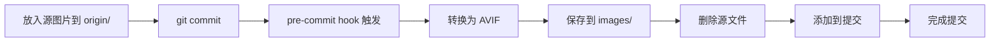

# Floria Gallery

一个专注于自动图片优化的照片画廊项目，通过 pre-commit hooks 自动将图片转换为 AVIF 格式，确保仓库中只存储最优化的图片文件。

## ✨ 特性

- 🚀 **自动化优化**：提交时自动将图片转换为 AVIF 格式
- 📦 **极致压缩**：AVIF 格式提供最佳的图片压缩比
- 🔄 **无缝工作流**：放入图片，正常提交，自动处理
- 🗂️ **清晰结构**：源文件与优化文件分离管理
- ⚡ **高性能**：使用 Sharp 库进行快速图片处理

## 📁 项目结构

```
floria-gallery/
├── origin/           # 源图片文件 (本地，不提交)
├── images/           # 优化后的 AVIF 文件 (提交到 Git)
├── scripts/
│   └── optimize-images.js   # 图片优化脚本
├── .husky/
│   └── pre-commit    # Git pre-commit hook
├── package.json      # 项目配置
└── README.md         # 项目说明
```

## 🚀 快速开始

### 1. 安装依赖

```bash
npm install
```

### 2. 使用方式

#### 方法一：通过 Git 提交自动处理（推荐）

1. **放入图片**：将 JPG/PNG 图片放入 `origin/` 目录
   ```bash
   cp your-photos/*.jpg origin/
   ```

2. **正常提交**：使用标准 Git 工作流
   ```bash
   git add .
   git commit -m "add new photos"
   ```

3. **自动处理**：pre-commit hook 会自动：
   - 将 `origin/` 中的图片转换为 AVIF 格式
   - 保存到 `images/` 目录
   - 删除源文件（避免重复处理）
   - 将 AVIF 文件添加到提交中

#### 方法二：手动执行优化

```bash
# 手动运行优化脚本
npm run optimize

# 或直接执行
node scripts/optimize-images.js
```

### 3. 支持的图片格式

- **输入格式**：JPG, JPEG, PNG
- **输出格式**：AVIF (质量65，最大压缩)

## 🔧 配置说明

### 图片优化设置

在 `scripts/optimize-images.js` 中可以调整：

```javascript
.avif({
  quality: 65,  // 图片质量 (0-100)
  effort: 6     // 压缩努力程度 (0-9)
})
```

### Git 忽略规则

`.gitignore` 配置确保：
- `origin/` 目录不被提交（源文件保持本地）
- 其他图片格式不被意外提交
- 只有 `images/` 中的 AVIF 文件被版本控制

## 🛠️ 工作流程详解



## 📝 常用命令

```bash
# 安装项目依赖
npm install

# 手动优化图片
npm run optimize

# 直接执行脚本
node scripts/optimize-images.js

# 查看项目状态
git status

# 正常提交流程
git add .
git commit -m "your message"
```

## 💡 使用技巧

1. **批量处理**：可以一次性将多张图片放入 `origin/` 目录，然后一次提交
2. **质量调整**：根据需要在脚本中调整 AVIF 质量参数
3. **空间节省**：AVIF 格式通常比 JPG 小 50% 以上
4. **兼容性**：现代浏览器都支持 AVIF 格式

## 🔍 故障排除

### 常见问题

**Q: 提交时没有自动处理图片？**
A: 检查 `.husky/pre-commit` 文件是否存在且可执行

**Q: 转换失败？**
A: 确保图片文件格式正确，路径中无特殊字符

**Q: Sharp 库安装失败？**
A: 尝试清除缓存：`npm cache clean --force && npm install`

### 手动修复 Husky

```bash
# 重新安装 Husky hooks
npx husky install
```

## 📊 性能对比

| 格式 | 文件大小 | 质量 | 兼容性 |
|------|----------|------|--------|
| JPG  | 100%     | 中等 | 完美   |
| PNG  | 150%     | 高   | 完美   |
| WebP | 70%      | 高   | 良好   |
| AVIF | 50%      | 极高 | 现代   |

## 🤝 贡献

欢迎提交 Issue 和 Pull Request！

## 📄 许可证

MIT License